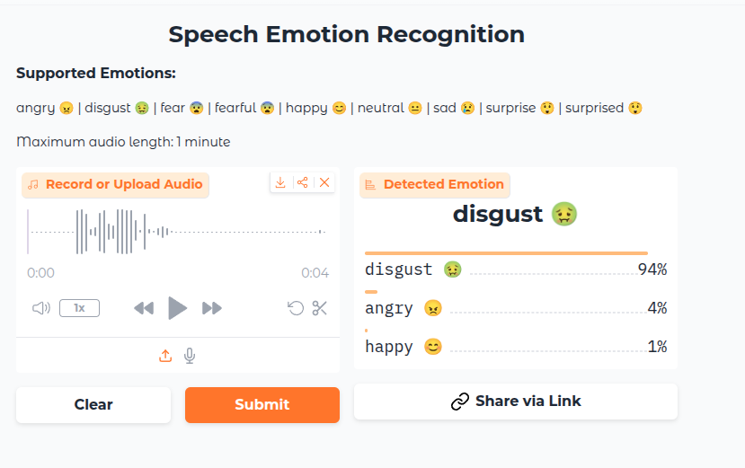
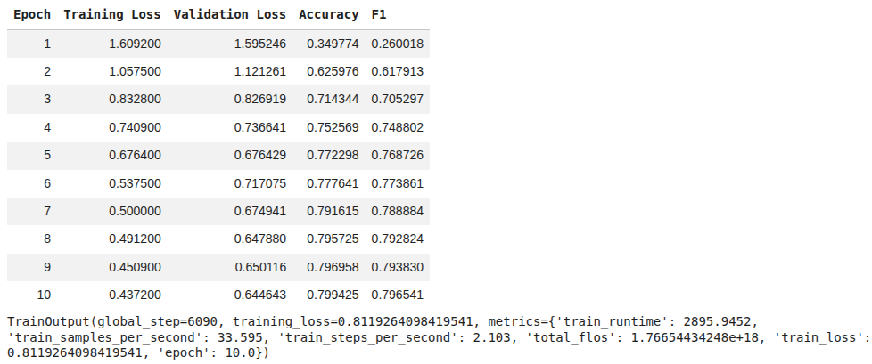

#  Speech Emotion Recognition




A Speech Emotion Recognition application built with **Gradio** and **Wav2Vec2**.
This project uses a fine-tuned transformer-based model to detect **7 different human emotions** from live microphone recordings or uploaded audio files.

**Live Demo:** [https://huggingface.co/spaces/DGautam11/Audio-Emotion-Recognition](https://huggingface.co/spaces/Dpngtm/Audio-Emotion-Recognition)

 **Model:** [https://huggingface.co/Dpngtm/wav2vec2-emotion-recognition](https://huggingface.co/Dpngtm/wav2vec2-emotion-recognition)

---

##  Features

*  **Real-time Inference:** Record voice directly from the browser
*  **File Upload:** Supports WAV, MP3, and FLAC audio files
*  **High Accuracy:** ~80% validation accuracy
*  **Robust Audio Preprocessing:**

  * Automatic resampling to **16 kHz**
  * Stereo-to-mono conversion


---

## Project Structure

```text
Audio-Emotion-Recognition/
├── app.py                       # Main Gradio UI application
├── requirements.txt             # Python dependencies
├── README.md                    # Project documentation
├── notebooks/                   # Training & experimentation notebooks
│   ├── 01_data_prepration.ipynb     # Dataset cleaning & merging
│   └── 02_wav2vec2_finetuning.ipynb # Wav2Vec2 fine-tuning pipeline
└── src/                         # Core source code
    ├── __init__.py              # Package marker
    └── inference.py             # Model loading & prediction logic
```

---

## Model Performance

The model was fine-tuned for **10 epochs** on a combined emotional speech dataset.
Below are the **final evaluation metrics** on the validation set:

| Metric          | Score      |
| --------------- | ---------- |
| Accuracy        | **79.94%** |
| F1 Score        | **79.65%** |
| Validation Loss | **0.6446** |

### Training Metrics per Epoch




---

##  Supported Emotions

The model predicts **7 discrete emotion classes**:

* 😠 **Angry**
* 🤢 **Disgust**
* 😨 **Fear**
* 😊 **Happy**
* 😐 **Neutral**
* 😢 **Sad**
* 😲 **Surprise**

---

##  Training Data

The model was fine-tuned using a **merged and balanced dataset** composed of four widely used, high-quality emotional speech corpora:

### Datasets Used

1. **TESS** 

2. **CREMA-D** 

3. **RAVDESS** 

4. **SAVEE** 

### Preprocessing Steps

* Resampled all audio to **16 kHz**
* Converted stereo audio to **mono**
* Normalized audio length
* Unified emotion label mapping across datasets
* Removed corrupted and low-quality samples


---

##  Installation & Usage

### 1 Clone the Repository

```bash
git clone https://github.com/DGautam11/Audio-Emotion-Recognition.git
cd Audio-Emotion-Recognition
```

### 2 Install Dependencies

```bash
pip install -r requirements.txt
```

**Key dependencies include:**

* `transformers` — model architecture
* `torch` — PyTorch backend
* `torchaudio` — audio processing
* `gradio` — web interface
* `numpy` — numerical utilities

### 3️⃣ Run the Application

```bash
python app.py
```

The Gradio app will launch locally at:
👉 **[http://127.0.0.1:7860](http://127.0.0.1:7860)**

---

## 🧠 Model Architecture

* Base Model: **Wav2Vec2** (self-supervised speech representation learning)
* Fine-tuning: Classification head for emotion prediction


---

## 🤝 Credits

* **Author:** Deepan Gautam (@DGautam11)
* **Frameworks & Tools:**

  * Hugging Face Transformers
  * Gradio
  * PyTorch

---

## 📜 License

This project is licensed under the **MIT License**.
Feel free to use, modify, and distribute with attribution.
